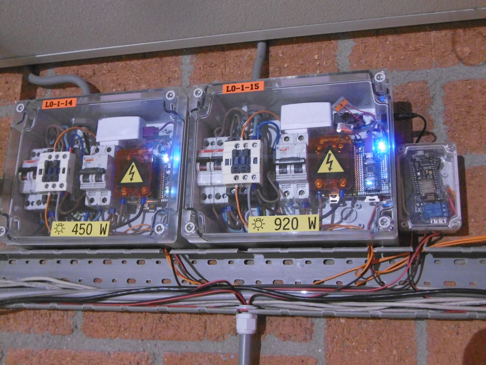

# Lichtknop (light button)

This projects contains code (and somehow also documentation) for the light ~~switches~~ switching logic at RevSpace.

The lights in the main room (*hoofdruimte*) should:
* Switch on when the space opens
* Switch off when the space closes
* Toggle their state when one of the push buttons is pushed
* Do all of the above reliable (not on an esp8266, regardless of network, etc)
* Switch off for 25 seconds when the nomz button is pushed
* Tell us their state so we can calculate power usage elsewhere

The lights in the other rooms should:
* Tell us their state so we can calculate power usage elsewhere

## `arduino`

This code runs on the two arduinos inside the two *main switch thingies*. It listens to spacestate and the push buttons, and switches a solid state relay which then switches a contactor (Schneider Electric LC1D09) which then switches the lights.

## `esp8266-hoofdruimte`

This code runs on the nodemcuv2 clone in the *auxiliary switch thingie*. It listens for MQTT topics (currently only `revspace/button/nomz`) and turns off the lights by interrupting the spacestate signal. It also listens for the helper contacts on the contactor to report the state on MQTT.

## `esp8266-other`

This code runs on d1-mini clones elsewhere in the space, connected after (motion activated) light switches, and their only job is to either tell us their light is on, or not tell us anything and let us know via MQTT LWT that their light is off.

Building this requires you to specify the room name like this:

```
PLATFORMIO_BUILD_FLAGS='-DROOM=\"exampleroom\"' pio run -t upload
```

This will then identify as `lightspace-exampleroom` and publish to `revspace/lightstate/exampleroom`.


